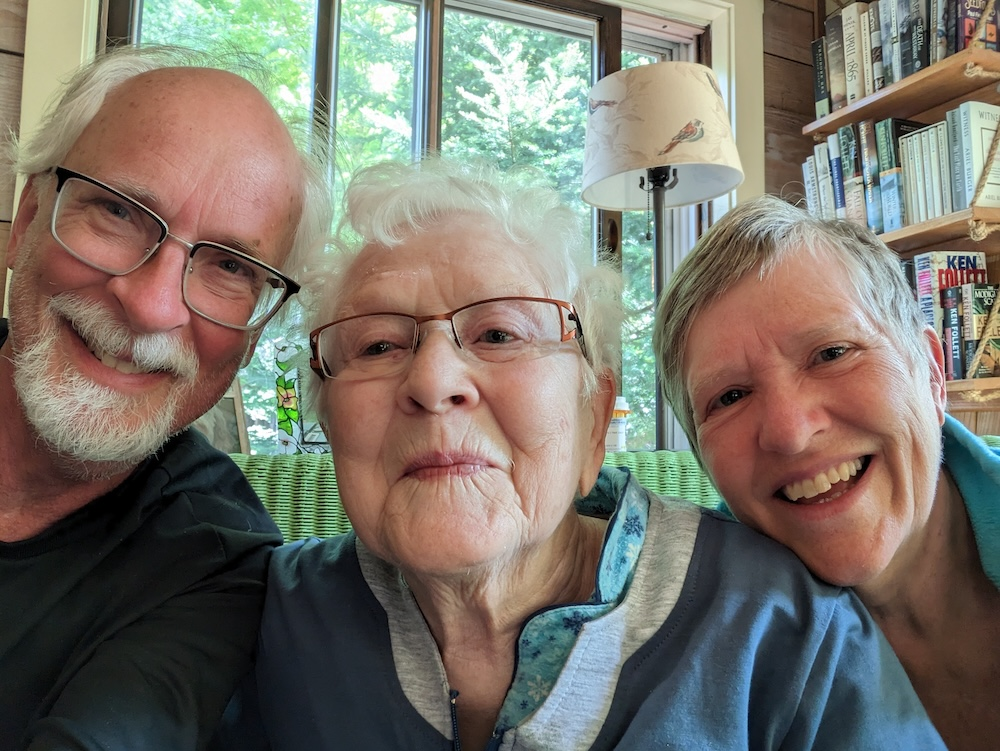

# About The Author {.unnumbered}

Thank you for reading "My Favorite Mother-In-Law." If you enjoyed it, won’t you please take a moment to leave me a review at your favorite retailer?

Mark Niemann-Ross writes mostly science fiction, sometimes programming in R, often about tinkering with Raspberry Pi (the single board computer, not the pastry).

He lives in Portland, Oregon, paddles boats, and gives compliments to strangers.

You can find him at <http://www.niemannross.com>, [LinkedIn](https://www.linkedin.com/in/markniemannross/), [GitHub](https://github.com/mnr/), [Goodreads](https://www.goodreads.com/author/show/2864412.Mark_Niemann_Ross), and [Mastodon](https://mastodon.social/@markniemannross).

## Other Titles by Mark Niemann-Ross

[Stupid Machine](https://niemannross.com/books-authored-mark-niemann-ross/stupidmachine/): Car accidents don’t happen in 2060. Which makes Jordan Bishop’s fatal crash in a self-driving vehicle unusual. Maybe even a murder. But who can tell? *Science Fiction*

[Humanity by Proxy](https://niemannross.com/books-authored-mark-niemann-ross/humanity-by-proxy-and-other-stories/): Humanity by Proxy and Other Stories celebrates the positive aspects of technology and it’s designers. *Science Fiction*

[Patches Catches the Sargo County Cattle Rustler](https://niemannross.com/books-authored-mark-niemann-ross/patches-catches-the-sargo-county-cattle-rustler/): Patches, a talented Border Collie, teams up with his young owner to outwit a cattle rustler in the old west. John is left in charge of his younger sister when his parents are called away on an emergency. When he finds a desperate outlaw in the kitchen, his only defense is a good story – and Patches. *Juvenile*

## Learn More about My Favorite Mother-In-Law

There's a lot happening in the world of this book. Find out more at this website:

{width="273"}

<http://niemannross.com/link/morefavemil>
