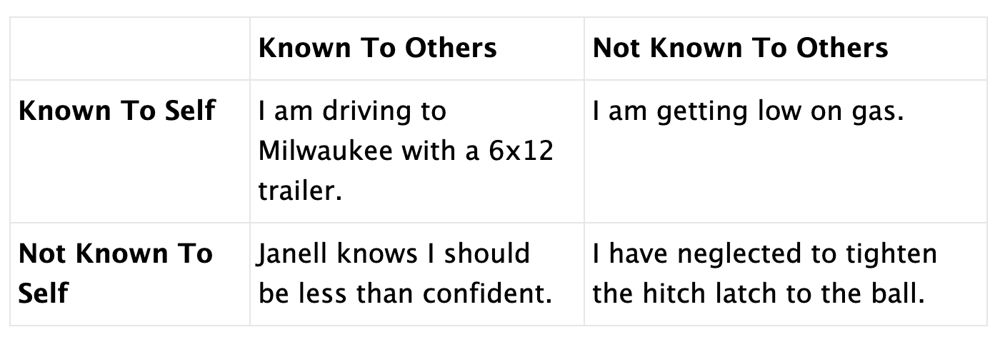

## Furnished Apartment {.unnumbered}

When Janell and I were first dating, I lived on a three-season porch. In Minnesota. In winter. With no heat or insulation on the large windows.

I had a space heater: one of those gray metal 1,500-watt devices with the two chrome bars attached to the front to prevent fires should the unit tip over on its face. This brave little toaster may have aspired to start a fire; instead, it tried its best to warm the room, but was no match for the high thermal conductivity of the wrap-around glass.

The heater pointed directly at my pillow with no discernible effect. For a bed, I had a two-inch foam pad and some sheets. Possibly a quilt. I was not big on home furnishings.

This sub-standard sleeping arrangement repelled Janell, but she was attracted by my youthful exuberance. Forty years later, I'm still exuberant, but room 202 of Evergreen Meadows Senior Community was going to be furnished differently. Once again, I realize how fortunate I was to marry her and put her in charge of improving my common sense.

Janell's sister agrees to loan us furnishings. This furniture, including a bed and table, are located in a Milwaukee storage unit. All I have to do is move it one hundred and fifty-five miles from Milwaukee to Stevens Point and return it when we are done.

"No problem," I confidently assure Janell. "Our car has a tow hitch, we can rent a 6x12 trailer from U-Haul, I'll drive down, load up, and we're set!" I am all enthusiasm, but no experience.

## My Theology

I've written a bit about my theology. I believe we aren't prepared to understand God. Here's an analogy: I raise chickens in my backyard. They are sweet and have their squabbles and sometimes I have to discipline or separate them.

But they don't understand what happens in the larger house standing next to their coop.

"It's important you understand the payment of electric bills," I say to the gathered flock. They circle around me, but I can tell their attention is brief; a fly or the discovery of a worm will soon distract them. "Electricity enables us to use the internet, which provides us access to the vast knowledge of the World Wide Web. The web provides me with information on how to keep you healthy, as well as the performance of the stock market."

They get bored and wander off. They lack the context and vocabulary to understand electricity and its related wonders. They also don't possess the cognitive skills to understand the internet or World Wide Web.

I suspect I have the same relationship with God. God thinks I'm sweet, but oh-so-dumb. I find it necessary to describe "him" in terms of a human presence, complete with arms, legs, and emotions because I can't wrap my head around a totally abstract God. "He" (she? it? them? they?) can't explain to me how I am wrong because I don't have the cognitive skills.

So I become distracted by flies and worms and erratically wonder how God works. But I will never attain cosmic wisdom.

## God is a Bartender

Instead of becoming overwhelmed with my inadequacies, I make something up. I choose to think of God as a good-natured fellow, with St. Peter as his trusty side kick and administrative assistant.

God seems to have taken an interest in my trip to Milwaukee.

*At this moment, God is serving drinks at his heavenly-themed pub. St. Peter, as is normal, is trying to manage God's omnipotent and omnipresent schedule.*

*"Pete!" God exclaims, looking up at St. Peter while he fills a pint with a cream stout on nitro. "Did you catch what Mark agreed to do?"*

*"Which one?" asks St. Peter.*

*"The one headed to Milwaukee," replies God. "Gospel Mark has the day off."*

*"It's on the list," St. Peter wearily points to the clipboard he has been carrying for the last millennium. He turns to the second page. "It's on line 1,048,323,499,092:"Mark drives to Milwaukee to pick up furniture."*

*"Right. That's the one." God delivers the pint to the prostitute sitting at the end of the bar (Everyone is welcome here). "Let's add some color to his life."*

*"You have better things to do," St. Peter flips back to page one, line one and begins to recite. God cuts him off.*

*"Yes, and we'll get to that. In the meantime, this newly arrived collection of poor in spirit and persecuted deserve a good laugh." God winks at the meek and mourning sitting next to the prostitute. "Can't inherit the kingdom of heaven without some good humor."*

*St. Peter contemplates the wineglass in front of him. He looks up at God, but God is telling jokes and giving his new friends reasons to rejoice and be glad.*

## Adventures In Moving

The U-Haul dealer believes I know what I am doing and leaves me to attach the trailer. I back the car up and try to lift the hitch onto the ball. I lift with my legs (not my back). Can't do it. Too heavy.

"Hmmm...," I ponder. Nobody else is around except the trailer and the car. They look at each other, snigger, and look back at me, feigning attentiveness. They aren't talking.

*God nudges the pure in heart, who is still adjusting to being able to see God. Pure-in-heart laughs nervously, takes a tentative sip, and watches the show on the big screen at the end of the bar.*

The car has a jack for changing a tire. Perfect. I jack up the trailer, back up the car, drop the jack, the hitch goes on the ball. Problem solved. The jack goes back in the car. I connect the safety chain, drive around the parking lot once to check my work. Everything stays attached, so I start off for Milwaukee!

## Johari's Window

There is a graphic counseling device called Johari's Window. It is used to help people understand their relationship with themselves and others. It is a grid of four squares: two rows, two columns. The columns are "Known to self" and "Not known to self." The rows are "Known to others" and "Not known to others." Each of the cells contains something revealing about the person or situation. Here is an example:

Remember; God is omniscient, so this doesn't apply to them/her/him/three-in-one. By association, everyone at the bar knows all as well, so they see the approaching punchline.

Cruising down the highway at 65 mph (My rearview mirror reflects WARNING: DO NOT EXCEED 55 MPH WITH THIS TRAILER) I question my pre-flight checklist. Did I put on the safety chains? (Yes). Did the trailer tires have air? (Yes). Was the trailer empty? (Yes). Did I tighten the hitch latch to the ball? (Possibly not. Sure I did. Can't remember. Yes. No.) Perhaps I should check.

Ahead is a rest stop - perfect for checking hitches. I turn smoothly and decelerate. Unfortunately, the Wisconsin Department of Transportation has neglected their maintenance on this rest area. There are potholes. BIG potholes filled with water. Potholes so frequent and so large they are impossible to dodge. I hit one, then a second. I look in the rear-view mirror and see the trailer lurching and bucking behind me. I feel a tug; the trailer has clearly jumped off the ball and is now free to run me down or puncture my gas tank. I sloooowly come to a stop, trying not to irritate this 6x12 untethered monster trailing my car.

I roll to a stop and breathe. Everything is still on the road. The trailer is still behind me. I walk to the back, expecting broken sheet metal and leaking gasoline.

The trailer tongue is in the dirt. It has wedged itself under the car and come to the end of the safety chain. I don't smell gas and there aren't any unsightly bruises in the bumper. Glorious! All I need to do is put the trailer back on the ball and we are good to go. So simple.

But the trailer is wedged under the bumper. I try to lift the car off the trailer tongue. I lift with my legs. Can't do it. Like deja-vue, I remember the jack. I lift the rear of the car, freeing the trailer from its entrapment.

## Chock, Jack, and Block

Chock is a funny word. It's a noun, it's a wedge, and comes in sets of four. They are used to keep the wheels of cars or trailers from unexpectedly rolling. In a pinch, you can use a brick, or a stump, or a rock. I had neglected to chock the wheels on the trailer before lifting the car.

The newly freed trailer rolls backwards. I can only watch in dismay - I know enough to not step behind the trailer (empty weight: 1,920 pounds). Today, I am a lucky boy. The chains are still attached; the car is still in contact with the ground; the trailer reaches the end of its tether and stops with a jerk. I resume breathing.

This will be easy to solve. I disconnect the safety chains and pull the car forward. I jack up the trailer, then back the car to the hitch. Only this time, I don't jack the trailer up far enough. With barely a nudge, the jack falls backward and the trailer again rolls towards the ditch. I stupidly watch. "Stupidly" because I should have chocked the wheels; "watch" because that's the sum total of actions available to me.

Three feet of drama later, the trailer stops, but for no good reason. I run to the nearby woods to find a piece of wood small enough for me to lift and large enough to chock a 1,920 pound trailer. With a new appreciation for trailer behavior, I again jack up the tongue and successfully mount the hitch to the ball. I reattach the chains. And yes, I finally lock the trailer to the ball. I return to the freeway.

*The entire bar-full of the blessed are trying not to snort beer through their noses. Even the murderer, forgiven for her sins but forevermore guilt-ridden, manages a chuckle. Perhaps there is redemption.*

## Gas. Rain.

My car displays the distance I can drive in miles. It does this by multiplying the calculated miles-per-gallon times gallons of gas in the tank. It's a computer trick added by an intern Honda hired for the summer. His name is Stephen. *Available Range* doesn't really tell me anything more than what I could observe by looking at the gas gauge at the bottom of the speedometer, but adding it to the car was the crowning act of Stephen's college degree.

For me, I am happy with analog: when the gas needle gets to the last quarter of the tank, I should fill up. That's where the needle is now, so I should do this. I watch signs for a freeway exit with a gas station.

*God grabs the remote and hands it to one of the merciful. "Turn up the volume," he/she/they laugh. The merciful hesitates; after all, they are merciful and worries how this will change this mortal's fate. God sees the hesitation and offers a promise of reward; "Don't worry, I got this." The merciful looks at St. Peter, who shakes his head in disbelief, but also nods assurance. The merciful turns up the volume.*

It is raining, so I turn on the wipers. First at intermittent, then low speed, then high as the abrupt storm obliterates the view of other cars and roadside features. The rain has enough force to bounce back in the air when it hits the hood of my car. I can't see the exit signs.

With the trailer dragging along behind, the car is getting half the normal MPG I expect. With a curse, I see Stephen's available range is a single digit. I have nine miles to buy gas. Oops - now I have eight. Seven. This trailer must have its brakes on. Stephen would be excited to see his internship project has dialed my anxiety up to eleven.

I am curious whether Stephen programmed his available range computer to stop at zero, or will he display negative numbers? If it goes to negative numbers, I will know Stephen has a warped sense of humor. It means he wrote a special routine which recognizes `IF (I am beyond hope) THEN {make fun of me}`.

The range goes to zero, then remains zero. Stephen has no sense of humor.

The obvious conclusion to this part of the story sees me walking five miles to a gas station in a pounding rain, wondering what seam of my raincoat is going to start leaking next. But my God is a merciful god. Or he must not have pushed my cream-pie button hard enough, because I turn off at the next exit and can see an (*open*) gas station. *Maybe the Merciful handed the remote to St. Peter who toned things down a bit.*

I don't know if Stephen programmed in a margin of safety, or how accurate his sensor data was, or if he simply did the calculation with no concern for human fragility. I am tempted to circle the gas pump until I truly sputter to a stop, but I am done tempting The Fates and fill up the tank. No more drama, please.

*"Okay everyone," God says. "Happy hour is over. Orientation starts in fifteen minutes." (Or 15 eons. Time is fluid in God's kingdom.) Everyone, including those hungering for righteousness (manifested as free bar snacks) head for the door.*

Somehow, things are suddenly quieter for me. The rest of the trip isn't worth writing about. I pick up the furniture; I return to Stevens Point; I unload the trailer; I return the U-Haul; I have an apartment with furnishings - an enormous step above the mattress and space heater of my youth. Janell is happy. I am happy.

Many people of faith look for evidence of God by praying for miracles. In my life, I've had way too many lucky brushes with fate to require proof. I'm not sure what God is, but I know I should be drowned or crushed or choked or out of gas or pushing a trailer out of a ditch.

Instead, I'm here in Stevens Point, telling jokes to my Mother-In-Law. For that, I feel an immense sense of grace and forgiveness.
